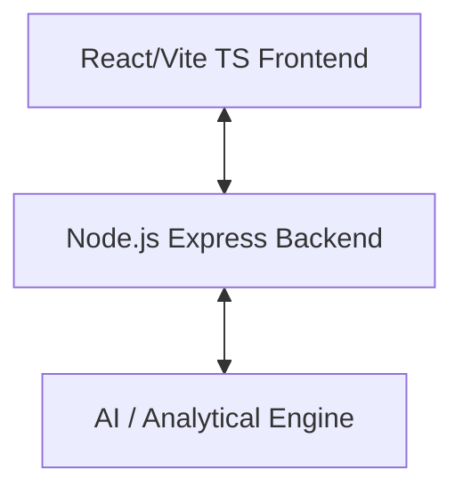

# TradeMind AI 🧠📈

TradeMind AI is a state-of-the-art intelligent trading and market analysis application. The repository is structured to separate concerns into frontend client, backend server, and AI-powered analytical modules.

---

## 🏗️ Project Architecture



### 📂 Directory Structure

- **[`client/`](file:///c:/Users/BaBa/Desktop/Projects/Trade/trademind-ai/client/)**: A high-performance, responsive React UI constructed using Vite and TypeScript.
- **[`server/`](file:///c:/Users/BaBa/Desktop/Projects/Trade/trademind-ai/server/)**: Node.js microservice handling APIs, user authentication, data aggregation, and routing to the AI models.
- **[`ai-engine/`](file:///c:/Users/BaBa/Desktop/Projects/Trade/trademind-ai/ai-engine/)**: Dedicated directory for python/JavaScript machine learning models, sentiment analysers, and automated trade execution engines.

---

## 🚀 Getting Started

### Prerequisites

- [Node.js](https://nodejs.org) (v18+)
- [npm](https://www.npmjs.com/) or [yarn](https://yarnpkg.com/)
- [Git](https://git-scm.com/)

### Running the Client

1. Navigate to the client folder:
   ```bash
   cd client
   ```
2. Install dependencies:
   ```bash
   npm install
   ```
3. Run the development server:
   ```bash
   npm run dev
   ```

### Running the Server

1. Navigate to the server folder:
   ```bash
   cd server
   ```
2. Install dependencies:
   ```bash
   npm install
   ```
3. Start the application:
   ```bash
   npm start
   ```

---

## 🛠️ Git Workflow

Initialize the remote origin when your GitHub repository is ready:
```bash
git remote add origin <your-repo-url>
git branch -M main
git push -u origin main
```
