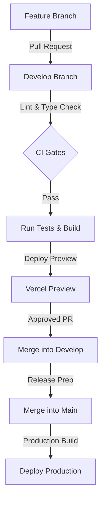

# TradeMind AI — Deployment Document

This document outlines the deployment strategy, environments, and CI/CD parameters for TradeMind AI.

---

## 1. Environments

The platform maintains three separate deployment stages:

| Stage | URL | Git Branch | Description |
| :--- | :--- | :--- | :--- |
| **Development** | `https://dev.trademind.ai` | `develop` | Active integration environment. |
| **Staging** | `https://staging.trademind.ai` | `release/*` | Release candidate testing, mirroring production. |
| **Production** | `https://app.trademind.ai` | `main` | Production-grade customer environment. |

---

## 2. CI/CD Git Pipeline Workflow

We enforce an automated Git Integration workflow:

1.  **Git Push Trigger:** Commit pushed to `develop` or `main`.
2.  **Lint Verification:** Executes `npm run lint`.
3.  **Type Checking:** Verifies typescript compiler runs without errors (`npm run build`).
4.  **Unit & Integration Tests:** Executes Vitest unit tests.
5.  **Build Phase:** Generates production bundle.
6.  **Continuous Deploy Preview:** Vercel automatically deploys a branch preview.

---

## 3. Deployment Parameters

*   **Frontend (Next.js/Vite Web App):** Deployed on Vercel.
*   **Express Backend API Server:** Deployed on Google Cloud Run (containerized using Docker).
*   **Python AI Engine:** Deployed on Google Cloud Run (containerized using Python base images).
*   **Database (PostgreSQL + RLS):** Managed by Supabase.
