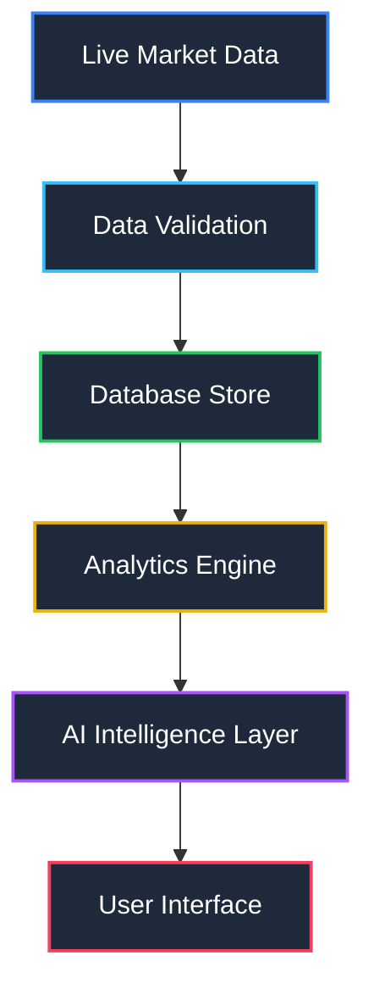
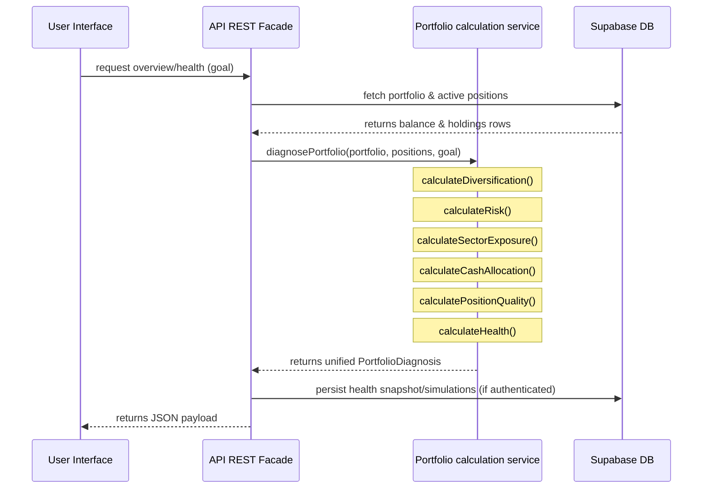

# TradeMind AI v1.0 — Architecture Document

This document defines the core architecture design system of the TradeMind AI platform, establishing the modular data-first pipelines that power the system.

---

## 1. Architectural Strategy: Data-First Pipeline

TradeMind AI places **Data** at the center of the system rather than the AI models themselves. This prevents vendor lock-in, ensures high performance, and isolates analytical computations from LLM variability.

### 1.1 Layers Description

1. **Live Market Data:** Direct feed of prices, tickers, volumes, and news feeds.
2. **Data Validation:** Zod and SQL constraints validate schemas, price bounds, and input formats before processing.
3. **Database Store:** Supabase/PostgreSQL instance containing snapshots, scores, history ledger, and paper trading state.
4. **Analytics Engine:** Core mathematical service calculating diversification, risk, sector exposure, cash allocation, and position quality metrics entirely on the backend.
5. **AI Intelligence Layer:** Explains analytics data, suggests rebalancing models, and produces human-digestible alerts without computing scores directly.
6. **User Interface:** High-aesthetic dashboard presenting gauges, X-Rays, allocation bars, rebalancing simulators, and alerts.

---

## 2. Calculation Flow (Portfolio Doctor Pro)

When diagnosing a portfolio, the analytics engine computes metrics in the following sequence:

---

## 3. Tech Stack Standard

*   **Frontend core:** React 18, TypeScript, Tailwind CSS / Vanilla CSS Variables
*   **State & Query:** React Query, Supabase client
*   **Backend Serverless Facade:** TypeScript API facades utilizing JWT tokens and RLS
*   **Testing suite:** Vitest
*   **Database engine:** PostgreSQL (Supabase) with RLS policies, composite indexes, and audit logs
