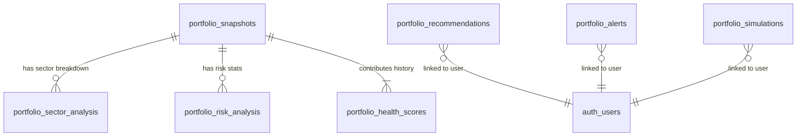

# TradeMind AI v1.0 — Database Document

This document defines the schema designs, index structures, foreign key constraints, and relational schemas implemented in Sprint 6.4 for the **Portfolio Doctor Pro** module.

---

## 1. Schema Diagram

---

## 2. Table Specifications

### 2.1 `portfolio_snapshots`
Logs a high-level summary of scores computed during execution.
*   `id` UUID PRIMARY KEY DEFAULT gen_random_uuid()
*   `user_id` UUID NOT NULL (Identifies user context)
*   `health_score` NUMERIC(5,2) NOT NULL (Value between 0.00 and 100.00)
*   `risk_score` NUMERIC(5,2) NOT NULL (Raw risk index)
*   `diversification_score` NUMERIC(5,2) NOT NULL (Diversification sub-score)
*   `sector_score` NUMERIC(5,2) NOT NULL DEFAULT 85.00 (Sector exposure sub-score)
*   `created_at` TIMESTAMP WITH TIME ZONE DEFAULT CURRENT_TIMESTAMP

### 2.2 `portfolio_health_scores`
Maintains a historical ledger of user health statistics to build the health trend timeline.
*   `id` UUID PRIMARY KEY DEFAULT gen_random_uuid()
*   `user_id` UUID NOT NULL
*   `health_score` NUMERIC(5,2) NOT NULL
*   `stability_score` NUMERIC(5,2) NOT NULL
*   `growth_potential_score` NUMERIC(5,2) NOT NULL
*   `risk_score` NUMERIC(5,2) NOT NULL
*   `grade` VARCHAR(5) NOT NULL (A+ to F letter grade)
*   `recorded_date` DATE NOT NULL DEFAULT CURRENT_DATE
*   `created_at` TIMESTAMP WITH TIME ZONE DEFAULT CURRENT_TIMESTAMP

### 2.3 `portfolio_sector_analysis`
Stores the detailed sector distribution percentages under snapshot records.
*   `id` UUID PRIMARY KEY DEFAULT gen_random_uuid()
*   `user_id` UUID NOT NULL
*   `snapshot_id` UUID REFERENCES portfolio_snapshots(id) ON DELETE CASCADE
*   `sector` VARCHAR(100) NOT NULL (Sector name)
*   `allocation_pct` NUMERIC(5,2) NOT NULL (Percentage of NAV)
*   `state` VARCHAR(50) NOT NULL (Overweight / Healthy / Underweight)
*   `risk_level` VARCHAR(50) NOT NULL (Low / Medium / High)
*   `ai_rating` NUMERIC(4,2) NOT NULL (Rating from 1.00 to 10.00)
*   `created_at` TIMESTAMP WITH TIME ZONE DEFAULT CURRENT_TIMESTAMP

### 2.4 `portfolio_risk_analysis`
Captures concentration levels, high-beta tags, and volatility metrics.
*   `id` UUID PRIMARY KEY
*   `user_id` UUID NOT NULL
*   `snapshot_id` UUID REFERENCES portfolio_snapshots(id)
*   `concentration_risk_pct` NUMERIC(5,2) NOT NULL (Largest position allocation)
*   `top_holding_symbol` VARCHAR(20) NOT NULL
*   `volatility_drag` NUMERIC(5,2) NOT NULL (Estimated volatility drag)
*   `risk_index` VARCHAR(20) NOT NULL (Low / Medium / High classification)
*   `created_at` TIMESTAMP WITH TIME ZONE

### 2.5 `portfolio_recommendations`
Stores prioritized AI rebalancing action logs.
*   `id` UUID PRIMARY KEY
*   `user_id` UUID NOT NULL
*   `recommendation` TEXT NOT NULL
*   `priority` VARCHAR(20) CHECK (priority IN ('high', 'medium', 'low'))
*   `status` VARCHAR(20) DEFAULT 'active' CHECK (status IN ('active', 'implemented', 'dismissed'))
*   `created_at` TIMESTAMP WITH TIME ZONE

### 2.6 `portfolio_alerts`
Logs institutional alerts triggered by concentration boundaries, cash buffers, or declining trends.
*   `id` UUID PRIMARY KEY
*   `user_id` UUID NOT NULL
*   `alert_type` VARCHAR(100) NOT NULL
*   `message` TEXT NOT NULL
*   `status` VARCHAR(50) DEFAULT 'active' CHECK (status IN ('active', 'resolved', 'dismissed'))
*   `created_at` TIMESTAMP WITH TIME ZONE

### 2.7 `portfolio_simulations`
Caches what-if scenario parameter logs for historical audits.
*   `id` UUID PRIMARY KEY
*   `user_id` UUID NOT NULL
*   `symbol` VARCHAR(20) NOT NULL
*   `action` VARCHAR(10) CHECK (action IN ('BUY', 'SELL'))
*   `quantity` INTEGER CHECK (quantity > 0)
*   `price` NUMERIC(12,2) NOT NULL
*   `initial_health` NUMERIC(5,2) NOT NULL
*   `predicted_health` NUMERIC(5,2) NOT NULL
*   `initial_cash_pct` NUMERIC(5,2) NOT NULL
*   `predicted_cash_pct` NUMERIC(5,2) NOT NULL
*   `created_at` TIMESTAMP WITH TIME ZONE

---

## 3. Query Performance & Speed Indexes

To maintain API requests running in under 2 seconds, indexing is applied to all key user fields:
*   `idx_port_snaps_user`: `(user_id, created_at DESC)` — Speed up snapshots queries.
*   `idx_port_sectors_snap`: `(snapshot_id)` — Rapid lookups of allocations.
*   `idx_port_risk_snap`: `(snapshot_id)` — Quick retrieval of risk records.
*   `idx_port_scores_user`: `(user_id, recorded_date DESC)` — Timeline charts acceleration.
*   `idx_port_recs_user`: `(user_id, status)` — Fast load of unresolved AI action cards.
*   `idx_port_alerts_user`: `(user_id, status)` — Direct fetch of active notifications.
*   `idx_port_sims_user`: `(user_id, created_at DESC)` — Historical simulation lookups.
